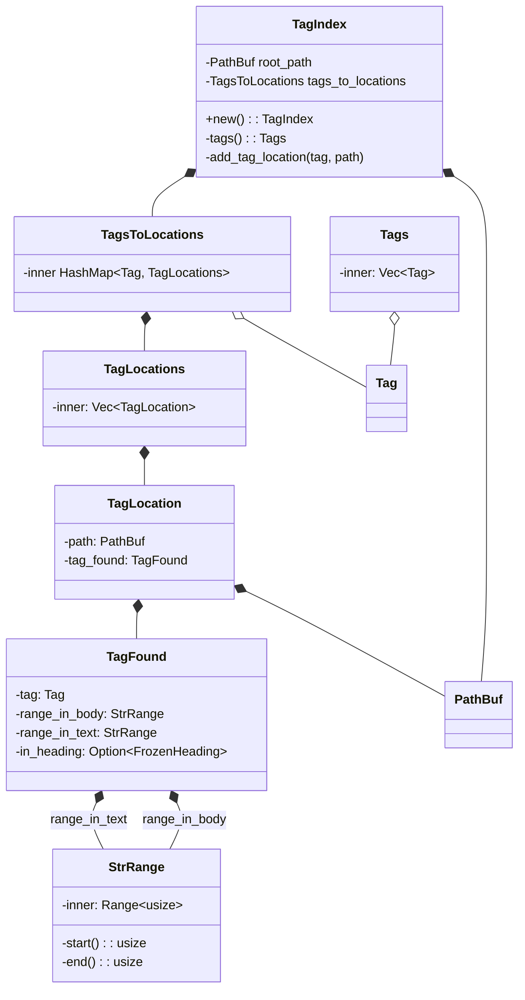

# etiquetas: tag wrangler

This repo contains tools (well, "tool") related to large-scale tag management for arbitrary 
hierarchies of markdown files. It's opinionated, and rather tailored to my workflow. It doesn't
assume a blogging or template system, or anything like that. It's really just about the files,
their content, and managing tagging.

I use this to accompany [Notebooks](https://www.notebooksapp.com), which is my primary non-IDE writing environment.

## What it does now

- Recursively scans a directory of markdown files
- Looks for tags matching a specific pattern
- Groups/aggregates tags, and shows file locations (path and range) for each.
- Displays the whole shebang as a tree, or a dump of Markdown parse events (in progress)

## What I'm adding

- Automatic scanning based upon fs events
- Generation of a Markdown index of tags, grouped and cross-referenced and visualized in various ways.
- A mechanism for managing tags in documents... correcting, coalescing, etc.
- Embeddings-based semiautomatic tag coalescing, tag suggestions, etc.

## How I work with tags currently

Each tag pattern has:
- Sigil (e.g. `#`, `@`, etc)
- Body `prj::type::tag-name`

## Example Tags

- `#fg::kw::convergence` : Keyword specific to project "fg", with body "convergence"
- `#fg::cat::behavioral` : A category related to behavior
- `#fg::pat::fubar` : A #fg::pat::fubar pattern.

## Model

